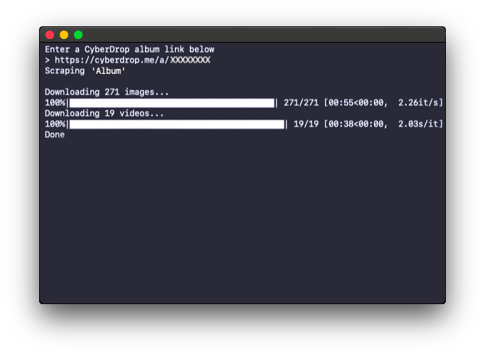

# CyberDrop
A media scraper for CyberDrop.me

# Purpose

This script is intended to scrape and download all image and/or video files from CyberDrop.me albums. After finding the files, the scraper will sort each file into their own respctive folder: 'Images' or 'Videos'.

Additionally, the scraped files will retain their *original* filenames and exclude the name extension that CyberDrop slaps onto each file.

# Installation

While in the project folder, go to your command line and run:

`pip install -r requirements.txt`

# Usage

While in the project folder, start the scraper by running the following in the command line:

`python cyberdrop.py`

The script will then ask you for a CyberDrop album link. Enter one after the `>` and then hit 'ENTER'.
